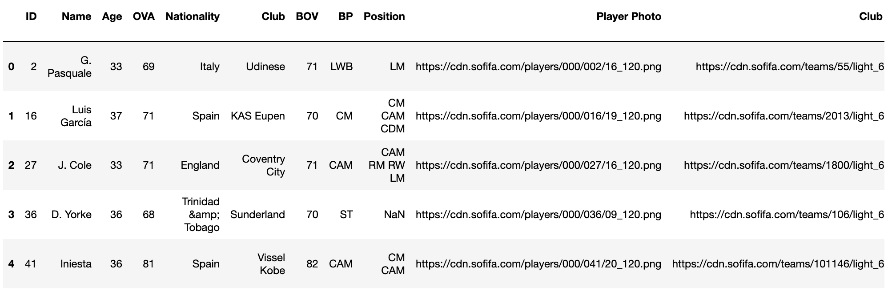

# FIFA21
In this project, I have chosen the FIFA21 database as the dataset for analysis.
FIFA21 is a popular video game that simulates professional soccer,
and its database contains various attributes and statistics of soccer players from around the world.

1. Objective
The goal is to clean and preprocess the data to predict the market value,
in addition to analyzing different insights.

2. Data
The DataFrame has 17,125 rows and 107 columns. It contains a combination of numerical data (float64 and int64) and object data (text strings)
/Users/iagogarrido/Documents/ironhack/data_mid_bootcamp_project_FIFA_MoneyBall/images

          
