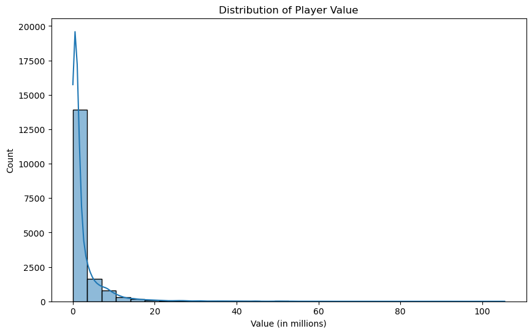
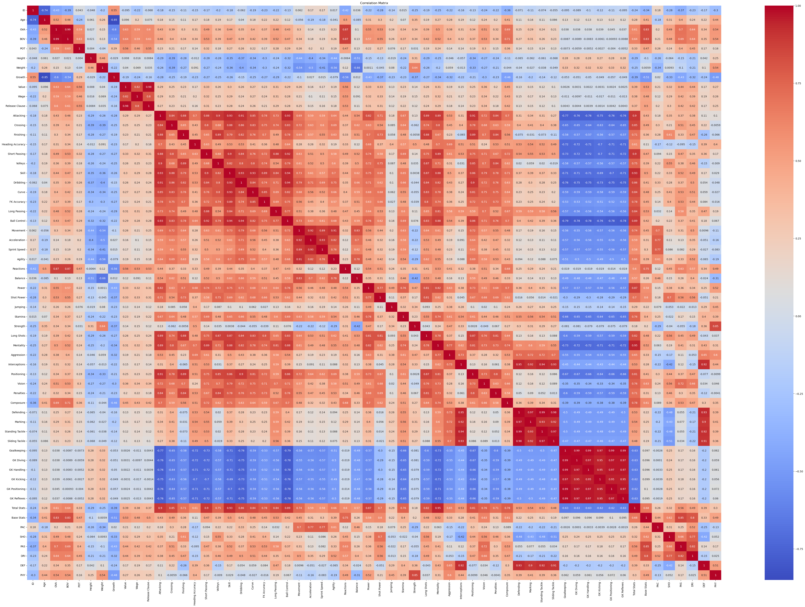
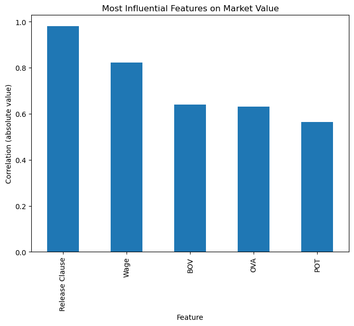

# FIFA21
In this project, I have chosen the FIFA21 database as the dataset for analysis.
FIFA21 is a popular video game that simulates professional soccer,
and its database contains various attributes and statistics of soccer players from around the world.

## 1. Objective
The goal is to clean and preprocess the data to predict the market value,
in addition to analyzing different insights.

## 2. Data
The DataFrame has 17,125 rows and 107 columns. It contains a combination of numerical data (float64 and int64) and object data (text strings)
/Users/iagogarrido/Documents/ironhack/data_mid_bootcamp_project_FIFA_MoneyBall/images

Each column name is the abbreviation of one 

**ID:** Unique identifier for each player in the FIFA 21 database.
**Name:** Player's name.
**Age:** Player's age.
**OVA:** Overall rating of the player in the FIFA 21 game.
**Nationality:** Player's nationality.
**Club:** Club to which the player belongs in the FIFA 21 game.
**BOV:** Best overall rating of the player in the FIFA 21 game.
**BP:** Best position preferred by the player on the field.
**Position:** Player's primary position on the field.
**Player Photo:** Photograph of the player.
**Club Logo:** Logo of the club to which the player belongs.
**Flag Photo:** Photograph of the player's national flag.
**POT:** Player's maximum potential rating in the FIFA 21 game.
**Team & Contract:** Player's current team and contract details.
**Height:** Player's height.
**Weight:** Player's weight.
**Foot:** Player's dominant foot (Right or Left).
**Growth:** Potential growth of the player.
**Joined:** Date when the player joined the current club.
**Loan Date End:** Date when the player's loan ends (if applicable).
**Value:** Market value of the player.
**Wage:** Player's salary.
**Release Clause:** Contract release clause of the player.
**Contract:** Remaining duration of the player's contract.
**Attacking:** Statistics related to the player's attacking abilities.
**Defending:** Statistics related to the player's defending abilities.
**Goalkeeping:** Statistics related to the player's goalkeeping abilities.
**Total Stats:** Total statistics of the player.
**Base Stats:** Base statistics of the player.
**W/F:** Weak foot/strong foot rating.
**SM:** Skill Moves rating (special movement skills).
**A/W:** Attack Work Rate.
**D/W:** Defense Work Rate.
**IR:** International Reputation index.
**PAC:** Pace rating of the player.
**SHO:** Shooting ability rating of the player.
**PAS:** Passing ability rating of the player.
**DRI:** Dribbling ability rating of the player.
**DEF:** Defensive ability rating of the player.
**PHY:** Physicality rating of the player.
**Hits:** Popularity or relevance rating of the player in the FIFA 21 game.
**LS:** Player's position on the field (Left Striker).
**ST:** Player's position on the field (Striker).
**RS:** Player's position on the field (Right Striker).
**LW:** Player's position on the field (Left Winger).
**LF:** Player's position on the field (Left Forward).
**CF:** Player's position on the field (Center Forward).
**RF:** Player's position on the field (Right Forward).
**RW:** Player's position on the field (Right Winger).
**LAM:** Player's position on the field (Left Attacking Midfielder).
**CAM:** Player's position on the field (Center Attacking Midfielder).
**RAM:** Player's position on the field (Right Attacking Midfielder).
**LM:** Player's position on the field (Left Midfielder).
**LCM:** Player's position on the field (Left Center Midfielder).
**CM:** Player's position on the field (Center Midfielder).
**RCM:** Player's position on the field (Right Center Midfielder).
**RM:** Player's position on the field (Right Midfielder).
**LWB:** Player's position on the field (Left Wing Back).
**LDM:** Player's position on the field (Left Defensive Midfielder).
**CDM:** Player's position on the field (Center Defensive Midfielder).
**RDM:** Player's position on the field (Right Defensive

 Midfielder).
**RWB:** Player's position on the field (Right Wing Back).
**LB:** Player's position on the field (Left Back).
**LCB:** Player's position on the field (Left Center Back).
**CB:** Player's position on the field (Center Back).
**RCB:** Player's position on the field (Right Center Back).
**RB:** Player's position on the field (Right Back).
**GK:** Player's position on the field (Goalkeeper).
**Gender:** Player's gender (Male or Female).

## 3. Data cleaning

- Checking for missing values
- Handling missing numerical values: For the columns 'Volleys', 'Curve', 'Agility', 'Balance', 'Jumping', 'Vision', 'Sliding Tackle', 'Composure', 'Interceptions', and 'Positioning', the missing values are filled using the mean or median of the respective columns. The code calculates the mean for 'Volleys', 'Curve', 'Sliding Tackle', 'Composure', and 'Interceptions' using the mean() function, and the median for 'Agility', 'Balance', 'Jumping', 'Vision', and 'Positioning' using the median() function. The fillna() function is used to fill the missing values in these columns with the calculated mean or median
- Handling missing categorical values: The missing values in the 'Club' column are filled with the string 'WITHOUT A CLUB', indicating that the player doesn't belong to any club. The missing values in the 'Position' column are filled with the values from the 'BP' (Best Position) column, assuming the best position is the same as the primary position.
- Handling missing values in other columns: The missing values in the 'A/W' (Attack Work Rate), 'D/W' (Defense Work Rate), and 'Joined' columns are filled with the values 'MEDIUM', 'MEDIUM', and 'Dec 31, 2020' respectively. These values are chosen as reasonable defaults.
- Dropping unnecessary columns: The code drops the columns 'Player Photo', 'Club Logo', 'Flag Photo', and 'Loan Date End' using the drop() function with axis=1 to remove those columns from the DataFrame.
- Data type conversion: The code performs data type conversions for certain columns. It removes the Euro symbol '€' from the 'Value', 'Wage', and 'Release Clause' columns using the str.replace() function. It replaces 'M' with 'e6' and 'K' with 'e3' to represent millions and thousands respectively. Then it converts the columns to float data type using the astype() function.

## 4. Exploratory Data Analysis (EDA) Visualizations
- Market value distribution

- Correlation matrix

- Most influential features in market value

